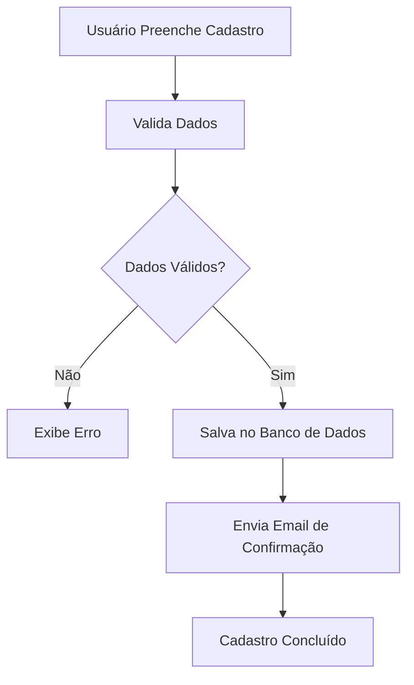
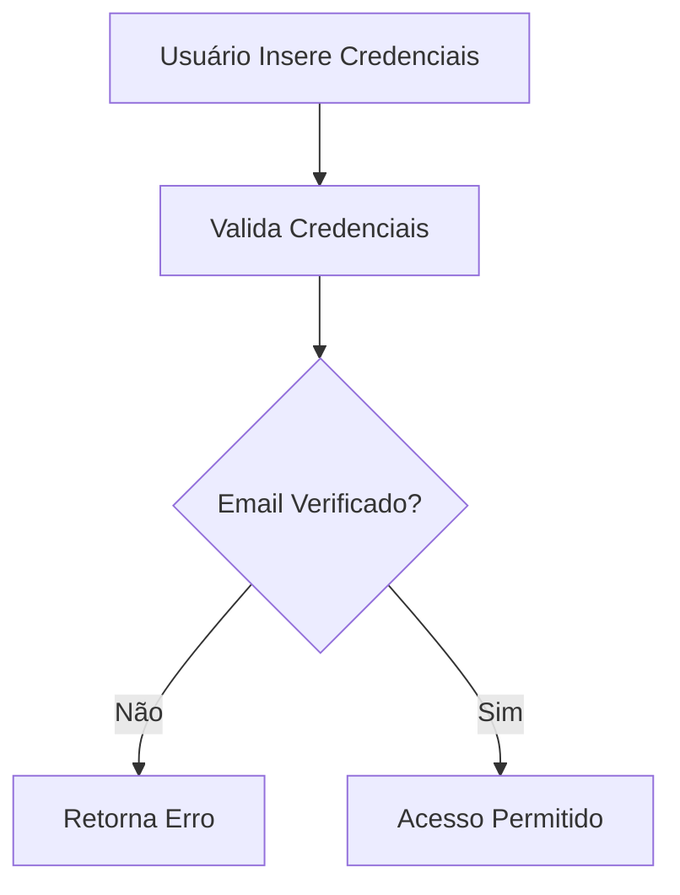
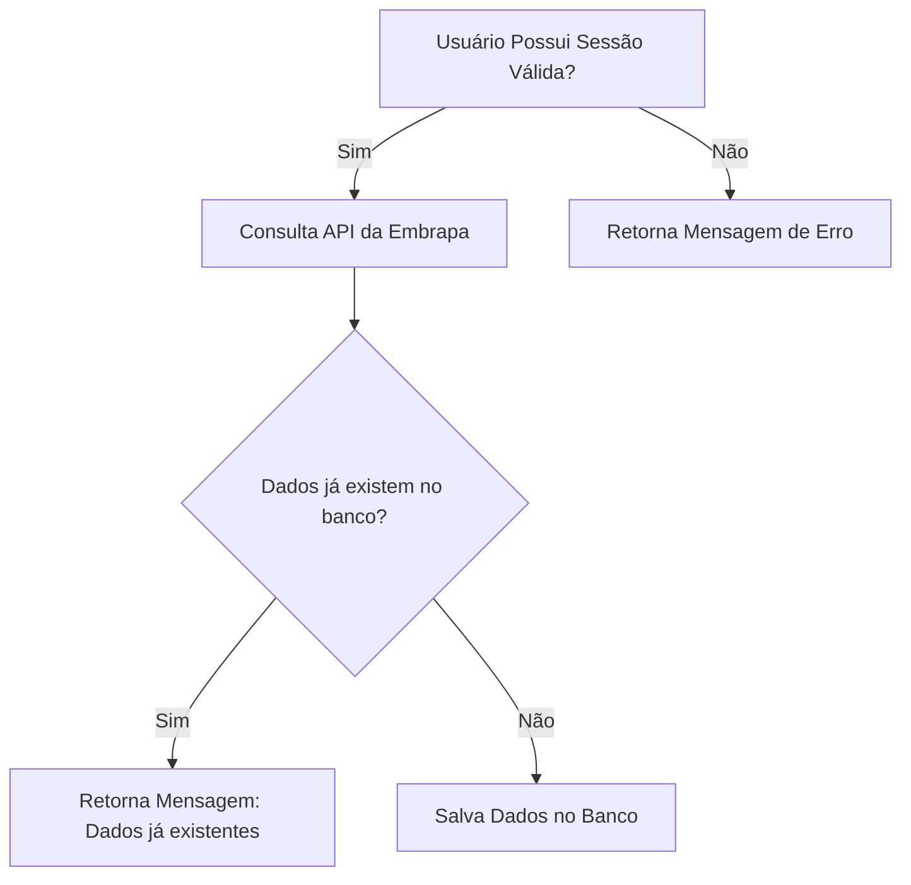

# Tech Challenge 01 - Embrapa

### O problema

Você foi contratado(a) para uma consultoria e seu trabalho envolve analisar os dados de vitivinicultura da Embrapa, 
os quais estão disponíveis [aqui](http://vitibrasil.cnpuv.embrapa.br/index.php?opcao=opt_01).

> **Aviso**: O link pode eventualmente sofrer instabilidade por se tratar do site do EMBRAPA. Caso isso ocorra, 
> por gentileza, tente novamente em alguns minutos.

A ideia do projeto é a criação de uma API pública de consulta nos dados do site nas respectivas abas:
- Produção.
- Processamento.
- Comercialização.
- Importação.
- Exportação.

A API vai servir para alimentar uma base de dados que futuramente será usada para um modelo de Machine Learning.

### Seus objetivos incluem:
-[x] Criar uma Rest API em Python que faça a consulta no site da Embrapa.
-[x] Sua API deve estar documentada.
-[x] É recomendável (não obrigatório) a escolha de um método de autenticação (JWT, por exemplo).
-[ ] Criar um plano para fazer o deploy da API, desenhando a arquitetura do projeto desde a ingestão até a alimentação do modelo (aqui não é Tech Challenge necessário elaborar um modelo de ML, mas é preciso que vocês escolham um cenário interessante em que a API possa ser utilizada).
-[ ] Fazer um MVP realizando o deploy com um link compartilhável e um repositório no github.

---

### Requisitos para a utlização em ambiente local
- Faça uma cópia do arquivo **.env.text** e crie um arquivo **.env**
- Preencha cada uma das variáveis de acordo com o seu ambiente de desenvolvimento
- Crie um banco de dados e realize as migrations com o comando: ``alembic upgrade head``
- Ao utilizar a aplicação em ambiente local, será possível visualizar a documentação pelo modelo [Swagger](http://127.0.0.1:8000/docs) e [Redoc](http://127.0.0.1:8000/redoc). Variando o domínio de acordo com o ambiente que você estiver executando.
- Para utilizar a API responsável realizar um cadastro e em seguida se autenticar para que seja possível visualizar o conteúdo extraído do site da Embrapa

### Principais bibliotecas para o desenvolvimento
- **Alembic:** Ferramenta de migração de banco de dados para SQLAlchemy, facilitando versionamento e atualização de esquemas.
- **Asyncpg:** Cliente PostgreSQL assíncrono eficiente e rápido, ideal para aplicações de alto desempenho.
- **Bcrypt:** Biblioteca de hashing de senhas segura, resistente a ataques de força bruta.
- **FastAPI:** Framework web moderno e rápido para APIs, baseado em Python e tipo hints.
- **Fastapi-Mail:** Biblioteca para envio de e-mails assíncronos com FastAPI e suporte a templates.
- **ItsDangerous:** Ferramenta para criar tokens seguros e assinar dados de forma confiável.
- **Pre Commit:** Framework para gerenciamento de hooks Git, automatizando verificações antes de commits.
- **Pydantic:** Validação de dados poderosa baseada em Python, usando modelos e tipo hints.
- **Pydantic Settings:** Gerenciamento de configurações utilizando Pydantic, facilitando validação e carregamento de variáveis.
- **Pylint:** Ferramenta de análise de código Python que verifica padrões e boas práticas.
- **PyJWT:** Manipulação de tokens JWT para autenticação segura em aplicações web.
- **SQLModel:** Biblioteca para manipulação de bancos de dados usando Pydantic e SQLAlchemy de maneira intuitiva.

### Fluxos de cada etapa funcional
- Cadastro com envio de e-mail

- Login com verificação de e-mail

- Consulta e armazenamento de dados da API da Embrapa

