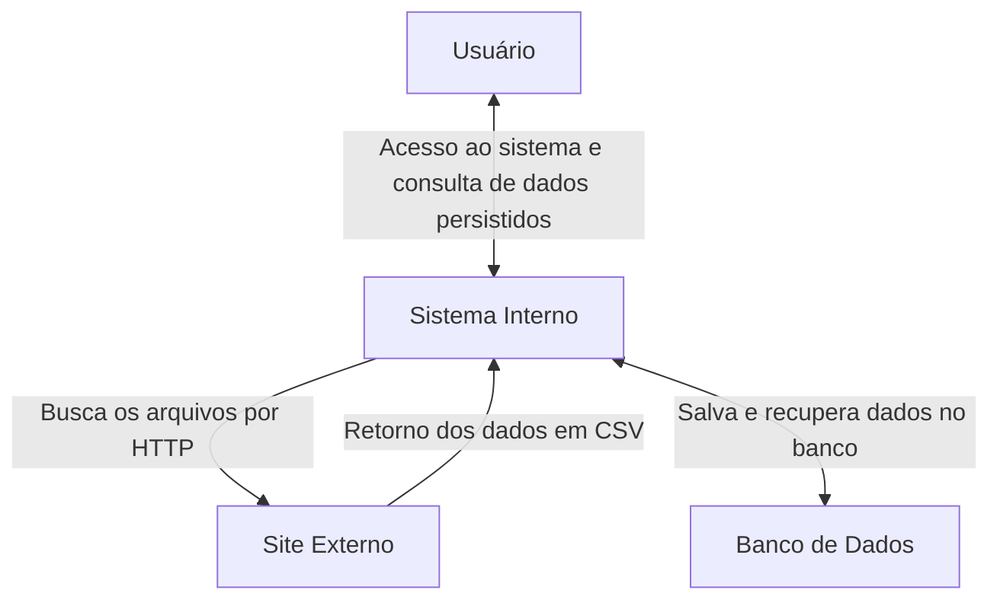
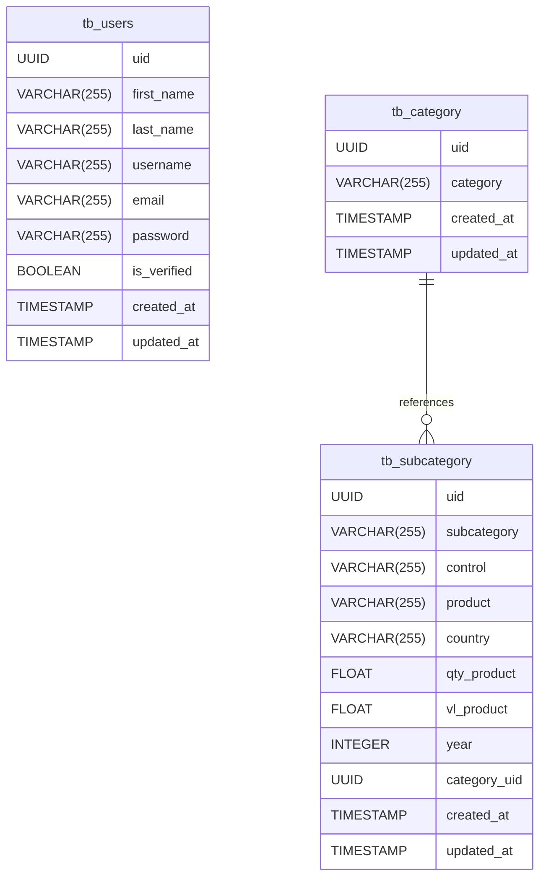

# Bem vindo

Seja bem vindo a documentação do **Tech Challenge 01 - Embrapa** utilizando [mkdocs.org](https://www.mkdocs.org).

## Arquitetura do projeto
Com o intuito de facilitar a manutenção e tempo de desenvolvimento, este projeto utiliza uma 
abordagem de design de software conhecida por arquitetura modular.

> Para saber mais sobre este modelo de arquitetura, leia o artigo da [AppMaster](https://appmaster.io/pt/blog/por-que-usar-uma-arquitetura-modular-no-design-de-software#melhores-praticas-para-implementacao-de-arquitetura-modular).

A ideia surgiu para permitir adaptações rápidas e maior flexibilidade para atender às necessidades do projeto.

## Layout do projeto
A estrutura de diretórios e arquivos é composta da seguinte forma:

    src                 # Diretório principal
        auth/               # Módulo de autenticação e cliente
            dependencies        # Utilitário responsável por validações de token JWT
            routes              # Camada de entrada responsável pela autenticação e visualização de cadastro
            schemas             # Camada que contem modelos de transferência (DTO) para o modelo de persistência 
            services            # Camada de serviço responsável pela comunicação com o banco de dados
            utils               # Utilitário responsável pela encodificação/decodificação de token JWT
        db/                 # Módulo de entidades
            main                # Camada responsável pela sessão entre aplicação e banco de dados
            models              # Camada responsável pelas entidades que compõem o projeto
        viticulture/        # Módulo de categorias e subcategorias
            clients             # Camada de comunicação externa e tratamento de dados para persistência
            enums               # Camada responsável por persistência e busca de dados
            routes              # Camada de entrada responsável pela persistência e busca de dados
            schemas             # Camada que contem modelos de transferência (DTO) para o modelo de persistência
            services            # Camada de serviço responsável pela comunicação com o banco de dados
            utils               # Utilitário responsável pela lógica de busca em ambiente externo
        __init__            # Camada principal responsável por centralizar as configurações do projeto
        config              # Camada responsável por configurar todos os parâmetros a partir de um arquivo ".env"
        mail                # Camada responsável pela configuração para envio de emails
        middleware          # Camada responsável pela configuração de CORS e logs personalizados

## Requisitos para ambiente local
Para iniciar a execução e compreensão deste projeto, é importante seguir os passos abaixo:

- Faça uma cópia do arquivo **.env.text** e crie um arquivo **.env**;
- Preencha cada uma das variáveis de acordo com o seu ambiente de desenvolvimento;
- Crie um banco de dados e realize as migrations com o comando: ``alembic upgrade head``;
- Ao utilizar a aplicação em ambiente local, será possível visualizar a documentação pelo modelo [Swagger](http://127.0.0.1:8000/documentation/swagger) e [Redoc](http://127.0.0.1:8000/documentation/redoc). Variando o domínio de acordo com o ambiente que você estiver executando;
- Para utilizar a API responsável realizar um cadastro e em seguida se autenticar para que seja possível visualizar o conteúdo extraído do site da Embrapa;
- Antes de realizar qualquer modificação, instalar hook do *pre-commit* ``pre-commit install``;
- Para atualizar a documentação, basta atualizar este arquivo e em seguida utilizar o comando ``mkdocs build`` para que ele seja atualizado no diretório *site*;
- Para visualizar apenas a documentação, basta utilizar o comando: ``mkdocs serve``;
- Para executar o projeto em ambiente local, basta utilizar o comando: ``fastapi dev src/``.

## Principais bibliotecas para o desenvolvimento
Esta seção tem como objetivo descrever as bibliotecas mais importantes que foram utilizadas neste projeto.

- **Alembic:** Ferramenta de migração de banco de dados para SQLAlchemy, facilitando versionamento e atualização de esquemas.
- **Asyncpg:** Cliente PostgreSQL assíncrono eficiente e rápido, ideal para aplicações de alto desempenho.
- **Bcrypt:** Biblioteca de hashing de senhas segura, resistente a ataques de força bruta.
- **FastAPI:** Framework web moderno e rápido para APIs, baseado em Python e tipo hints.
- **Fastapi-Mail:** Biblioteca para envio de e-mails assíncronos com FastAPI e suporte a templates.
- **ItsDangerous:** Ferramenta para criar tokens seguros e assinar dados de forma confiável.
- **MkDocs:** Gera sites de documentação estática usando Markdown, simples e eficiente.
- **MkDocs Material:** Um tema elegante para MkDocs, baseado no Material Design, com recursos avançados.
- **Pre Commit:** Framework para gerenciamento de hooks Git, automatizando verificações antes de commits.
- **Pydantic:** Validação de dados poderosa baseada em Python, usando modelos e tipo hints.
- **Pydantic Settings:** Gerenciamento de configurações utilizando Pydantic, facilitando validação e carregamento de variáveis.
- **Pylint:** Ferramenta de análise de código Python que verifica padrões e boas práticas.
- **PyJWT:** Manipulação de tokens JWT para autenticação segura em aplicações web.
- **SQLModel:** Biblioteca para manipulação de bancos de dados usando Pydantic e SQLAlchemy de maneira intuitiva.

## Passos para o deploy utilizando o Render
Esta seção trás uma breve descrição dos passos necessários para o deploy de uma 
aplicação utilizando o [Render](https://dashboard.render.com/) como plataforma.

- Configurar um banco de dados Postgres;
- Executar a aplicação em ambiente local com a nova conexão da base de dados para atualizar todas as tabelas;
- Configurar um novo Web Service;
- Incluir todas as variáveis inclusas no arquivo **.env**;
- Acompanhar o deploy das aplicações e realizar o teste de acordo com o endereço atribuído.

## Diagrama de fluxo

Esta seção apresenta uma forma simplificada de como funciona o fluxo de escrita e leitura.

## Modelagem do banco de dados
- Modelagem do banco de dados para este projeto

